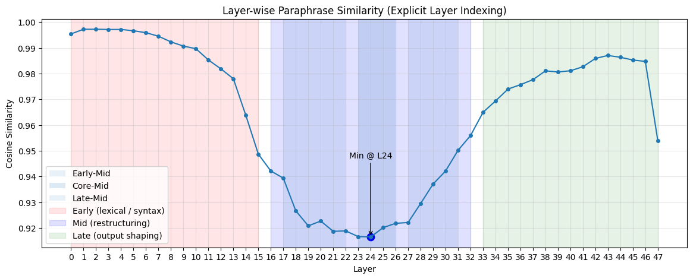
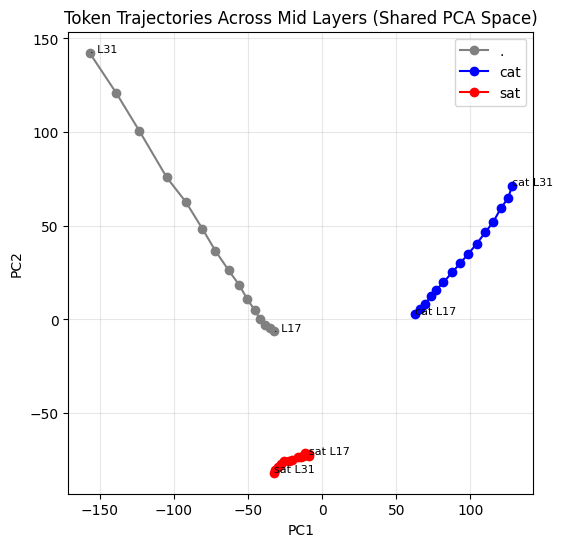
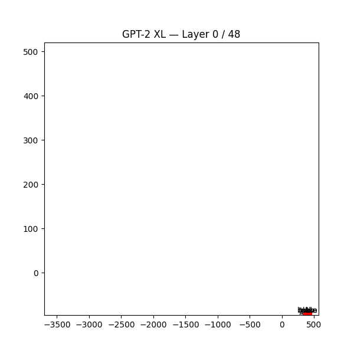

# 🧅 SituatiONION  
# Transformer Representation Analysis Pipeline

Experimental pipeline for extracting and evaluating hidden state representations from transformer language models to quantify how semantic information emerges across layers.

---
All figures in this directory are original works generated
by the SituatiONION project.
© 2026 Archisa Bhattacharya
Reuse requires attribution.

## Overview

Transformer models encode increasingly abstract semantic structure as information propagates through layers. This project builds a reproducible pipeline to:

- Extract hidden state representations from each transformer layer
- Construct feature datasets from embeddings
- Quantitatively evaluate representation quality using linear probes
- Visualize representation geometry using dimensionality reduction

Core questions:

- Where in the network is semantic information most separable?
- How does representation structure evolve across depth?
- Which layers produce the most useful downstream features?

---
## Key Results

<figure>
  
  <figcaption>
    <b>Figure 1.</b> Linear probe accuracy as a function of transformer layer depth. Separability increases from early layers, peaks in mid-layers, and declines or stabilizes in later layers. This pattern indicates that mid-layers contain the most linearly separable and semantically structured representations, consistent with the SituatiONION hypothesis.
  </figcaption>
</figure>

<br>

<figure>
  
  <figcaption>
    <b>Figure 2.</b> PCA projection of token representations across transformer layers. Early-layer representations are diffuse and weakly organized, mid-layer representations form structured and well-separated clusters, and late-layer representations exhibit convergence toward task-specific encoding. This progression indicates the emergence of a structured semantic regime in mid-layers, consistent with the SituatiONION hypothesis.
  </figcaption>
</figure>

<br>

<figure>
  
  <figcaption>
    <b>Figure 3.</b> Animated PCA projection of token representations across transformer layers for the sentence "John put the glass on the table. It broke." Token trajectories are relatively diffuse in early layers, undergo pronounced geometric reorganization in mid-layers, and stabilize in later layers. The increased mid-layer movement reflects a transition from surface-level encoding to structured semantic representation, consistent with the SituatiONION hypothesis. 
  </figcaption>
</figure>
---

## Pipeline

```
Text Input
  ↓
Tokenization
  ↓
Transformer Forward Pass
  ↓
Hidden State Extraction
  ↓
Feature Dataset Construction
  ↓
Evaluation (Linear Probe)
  ↓
Visualization (PCA)
```

---

## Method

### Hidden State Extraction

Extract layer-wise representations using HuggingFace Transformers:

```python
outputs = model(**inputs, output_hidden_states=True)
hidden_states = outputs.hidden_states
```

Produces tensor:

```
[num_samples, num_layers, hidden_dimension]
```

---

### Linear Probe Evaluation

Train linear classifiers to measure semantic separability:

```python
probe = LogisticRegression(max_iter=1000)
probe.fit(X_train, y_train)
accuracy = probe.score(X_test, y_test)
```

Higher accuracy → stronger semantic encoding.

Evaluated independently across all layers.

---

### Visualization

Use PCA to inspect representation geometry:

```python
pca = PCA(n_components=2)
X_reduced = pca.fit_transform(X)
```

Reveals clustering and structural evolution across layers.

---

## Tech Stack

- Python
- PyTorch / HuggingFace Transformers
- NumPy
- scikit-learn
- Matplotlib

---

## Results Summary

Typical findings:

- Early layers encode lexical features
- Middle layers encode semantic structure
- Later layers encode task-specific abstractions
- Linear separability peaks in mid-to-late layers

Confirms progressive semantic organization in transformer representations.

---

## Applications

- Model interpretability
- Representation evaluation
- Feature extraction
- Transformer analysis
- Downstream ML feature engineering

---

## Author
Author: Archisa Bhattacharya  
Copyright © 2026 Archisa Bhattacharya


